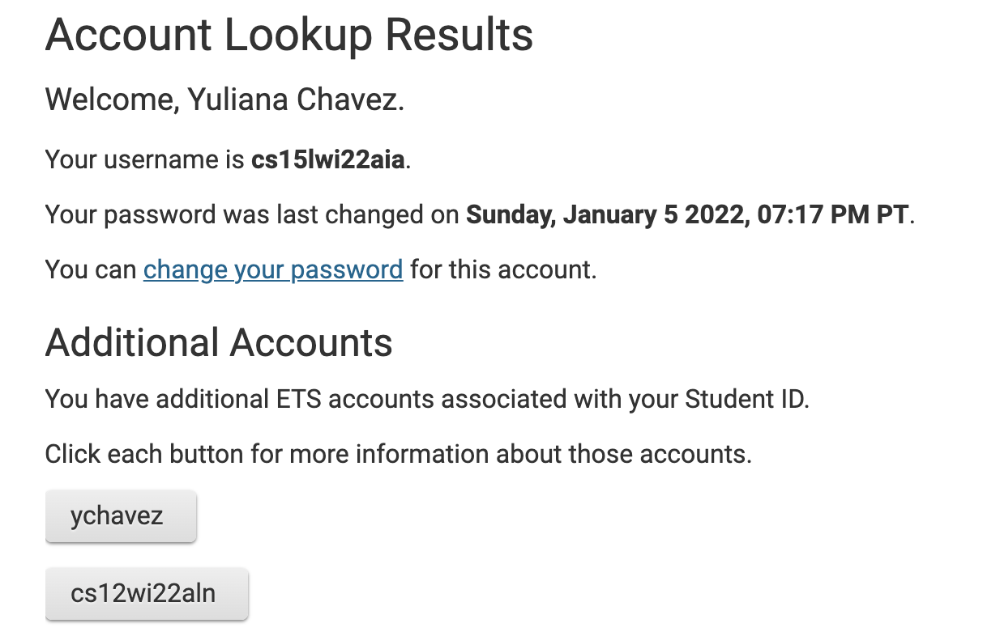
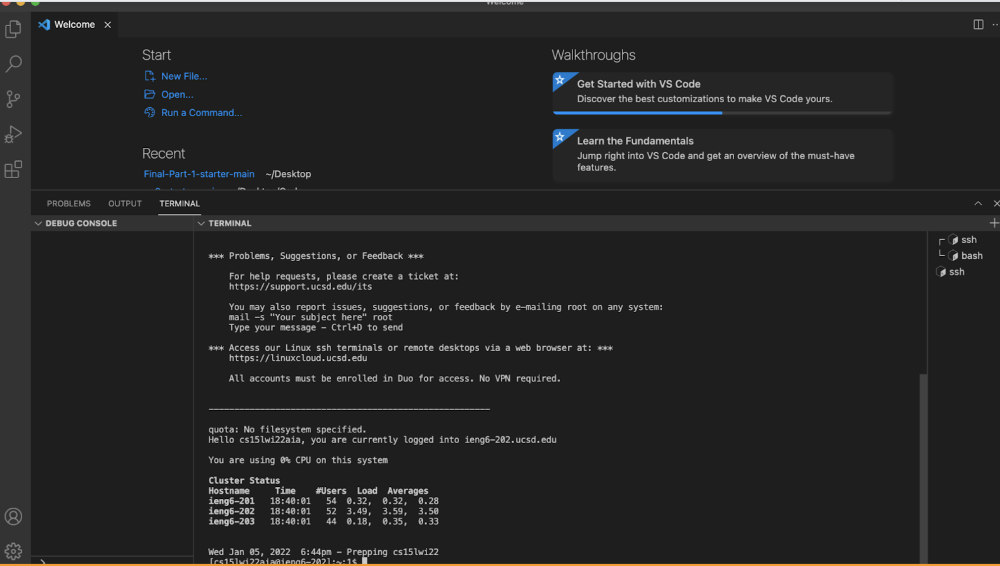
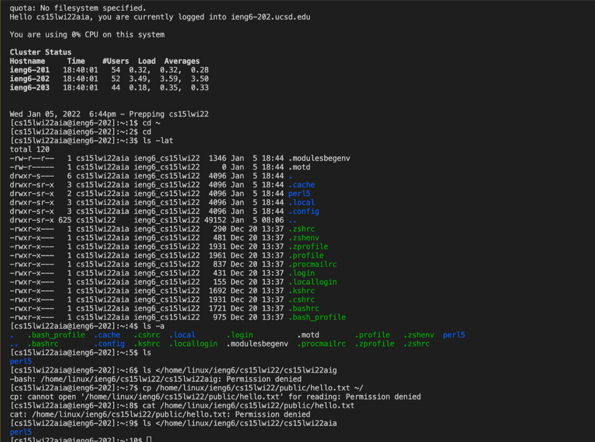
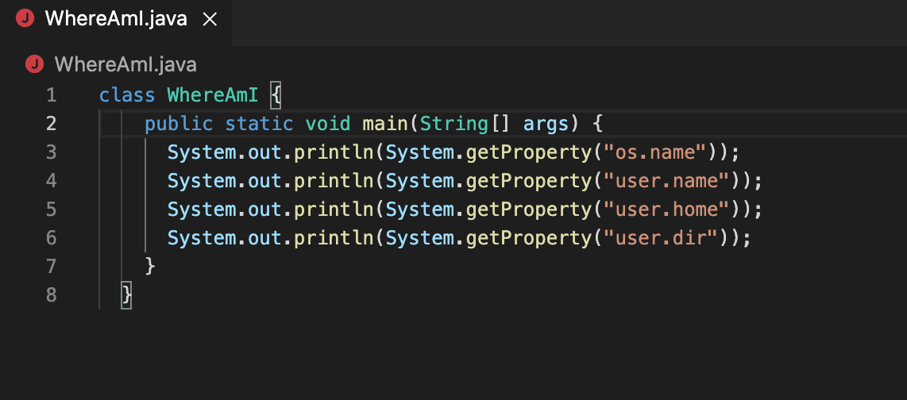
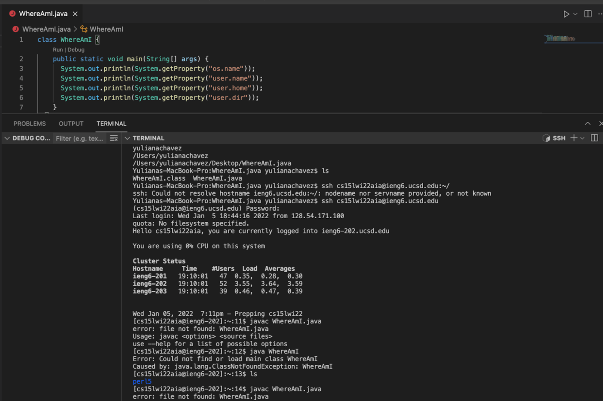
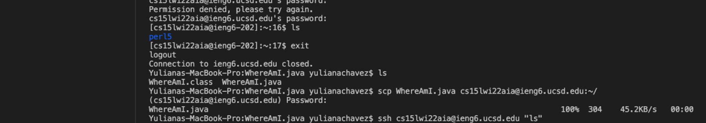
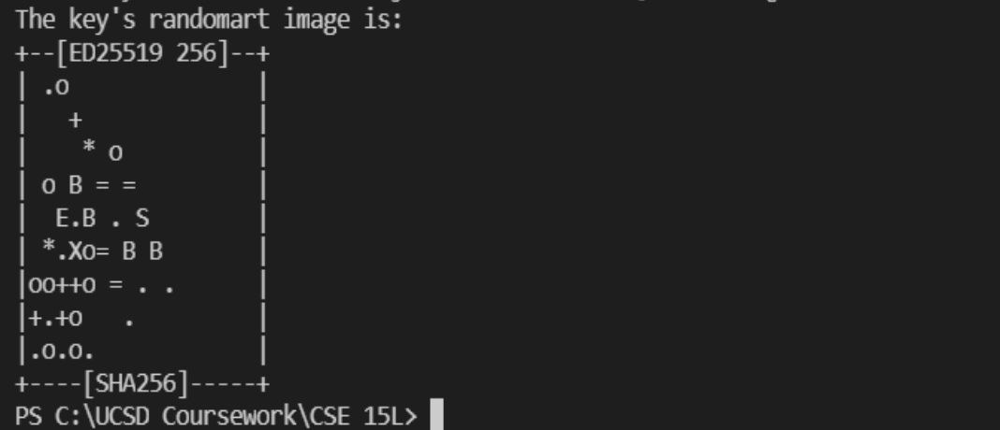
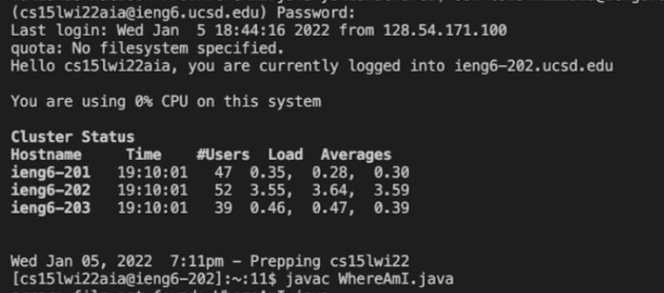
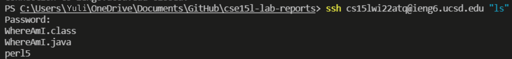

# Lab Report 1 Week 2
## 1. Install VS code onto your device

First I installed Visual Studio Code. I went to [https://code.visualstudio.com/](https://code.visualstudio.com/) and followed the instructions for the OSX version for my Mac.

I looked up my course specific account on [https://sdacs.ucsd.edu/~icc/index.php](https://sdacs.ucsd.edu/~icc/index.php) by reseting my password first. My course specefic account is cs15lwi22aia.
## 2. Remotely Connecting

I opened the terminal and typed in 

`$ ssh cs15lwi22aia@ieng6.ucsd.edu`

to connect to the remote server. After entering the new password I created I received this. This means that now I the *client* and the *server* are connected.
## 3. Trying Some Commands

Some commands I ran are 

`ls directory`

this returned lists all files and folders in that directory * ls lat,

`ls-l`

gives the directory in a long format

`cat *file*`

 gives a copy of that file

## 4. Moving Files With scp
To copy a file from my computer to a remote computer I used the command scp. To display this I created a file called WhereAmI.java with the following code : 

Once compiled and run I was prompted for a password and received this outcome. 

Meaning that the directories are different compared to my computer. This was the result of running the scp command.

## 5.Setting an SSH Key

Running ssh-key on VS Code allows it to save at the default location.

When logging out I ran a scp command that sends the ssh file from my computer (client) to the UCSD remote computer (server). This allwed me to enter with my passphrase.

## 6.Optimizing Remote Running
To optimize remote running you can use semicolons to run multiple commands on the same line

`$ cp hello.java OtherMain.java; javac OtherMain.java; java hello
`

You can use the up arrow to go the previously used commands in the terminal.

I also copied down onto my notes app frequently used commands such as `cs15lwi22aia@ieng6.ucsd.edu`, `WhereAmI.java`, `javac WhereAmI.java`,`java WhereAmI`
to save me time from directly typing out each command

Keystroke count:

* 1 keystroke to open notes app
* 2 keystrokes to copy and paste `scp cs15lwi22aia@ieng6.ucsd.edu:~/.`
* 2 keystroke to copy and paste `cch cs15lwi22aia@ieng6.ucsd.edu`
* 3 stroketo paste `ssh cs15lwi22aia@ieng6.ucsd.edu` and open VS code and terminal
* 3 strokes to click up button to select `javac WhereAmI.java`
* 3 stroke to open notes app and paste `javac WhereAmI.java` and put quotation marks around it
* 2 strokes to add a semi colon after `javac WhereAmI.java`
* 4 stroke to copy and paste `java WhereAmI` 

For a total of 20 keystrokes

