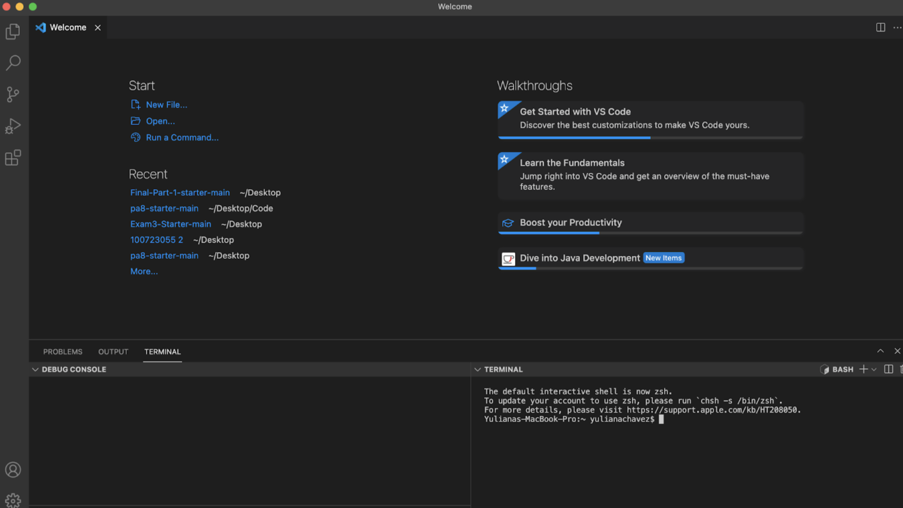

# Lab Report 1 Week 2
## 1. Install VS code onto your device

First I installed Visual Studio Code. I went to [https://code.visualstudio.com/](https://code.visualstudio.com/) and followed the instructions for the OSX version for my Mac.

I looked up my course specific account on [https://sdacs.ucsd.edu/~icc/index.php](https://sdacs.ucsd.edu/~icc/index.php) by reseting my password first. My course specefic account is cs15lwi22aia.
## 2. Remotely Connecting

I opened the terminal and typed in 
>$ ssh cs15lwi22aia@ieng6.ucsd.edu

to connect to the remote server. After entering the new password I created I received this. This means that now I the *client* and the *server* are connected.
## 3. Trying Some Commands

Some commands I ran are 
* ls directory, this returned lists all files and folders in that directory * ls lat, 
* ls-l, gives the directory in a long format
* cat *file*, gives a copy of that file

## 4. Moving Files With scp
To copy a file from my computer to a remote computer I used the command scp. To display this I created a file called WhereAmI.java with the following code : 

Once compiled and run I was proimpted for a password and received this outcome. 

Meaning that the directories are different compared to my computer. This was the result of running the scp command.

## 5.Setting an SSH Key

## 6.Optimizing Remote Running