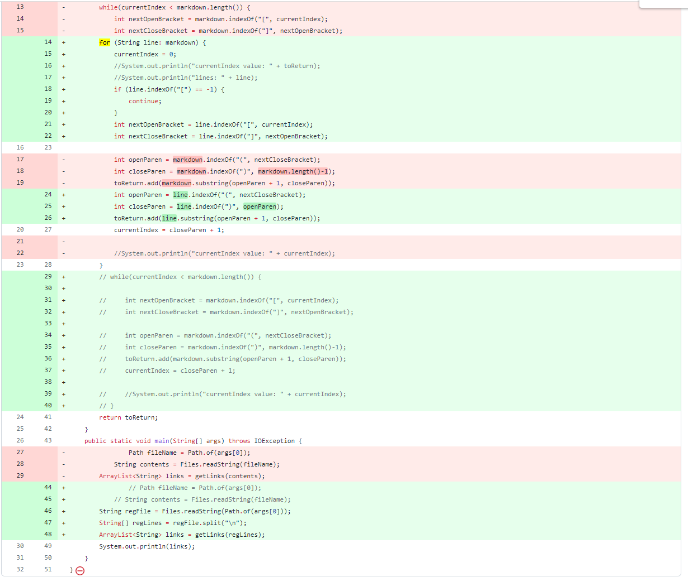
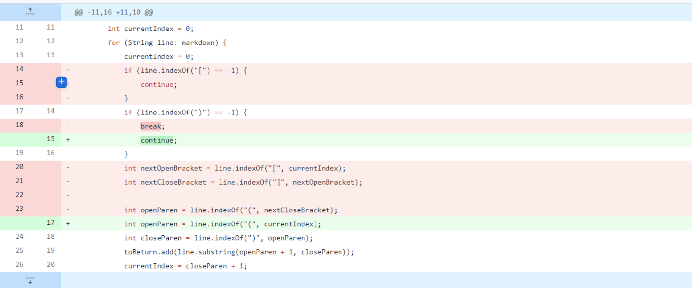
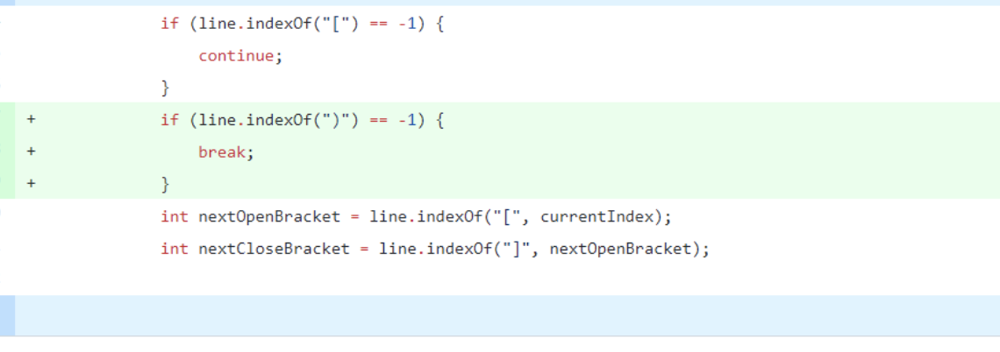

# Lab Report 2
## Code Change 1 
[Test file](https://github.com/ygchavez/markdown-parse/blob/main/test-file1.md)


Symptom: 
```
C:\Users\yulianachavez\Desktop\Documents\GitHub\markdown-parse> java MarkdownParse test-file1.md

Exception in thread "main" java.lang.StringIndexOutOfBoundsException: begin 10, end -1, length 33
```
We made `int closeParen` be equal to `markdown.indexOf(")", openParen)`. This caused an error that `end -1` was unable to find and end parenthesis returning `-1`.
## Code Change 2
[Test file](https://github.com/ygchavez/markdown-parse/blob/main/test-file2.md)

Symptom: 
```
PS C:\Users\yulianachavez\Desktop\Documents\GitHub\markdown-parse> java MarkdownParse test-file2.md
[]
```
An edge case we found was that the code did not work correctly with empty brackets `[]` or parenthesis `()`causing an empty set to be returned.
## Code Change 3
[Test file](https://github.com/ygchavez/markdown-parse/blob/main/test-file3.md)

Symptom: 
```
C:\Users\yulianachavez\Desktop\Documents\GitHub\markdown-parse> java MarkdownParse test-file3.md

Exception in thread "main" java.lang.StringIndexOutOfBoundsException: begin 0, end -1, length 3 at java.base/java.lang.String.checkBoundsBeginEnd(String.java:4601)
```
There is no interpretation if there was a link. When no parenthesis were found a `-1` was returned causing this to be a failure inducing input.  
