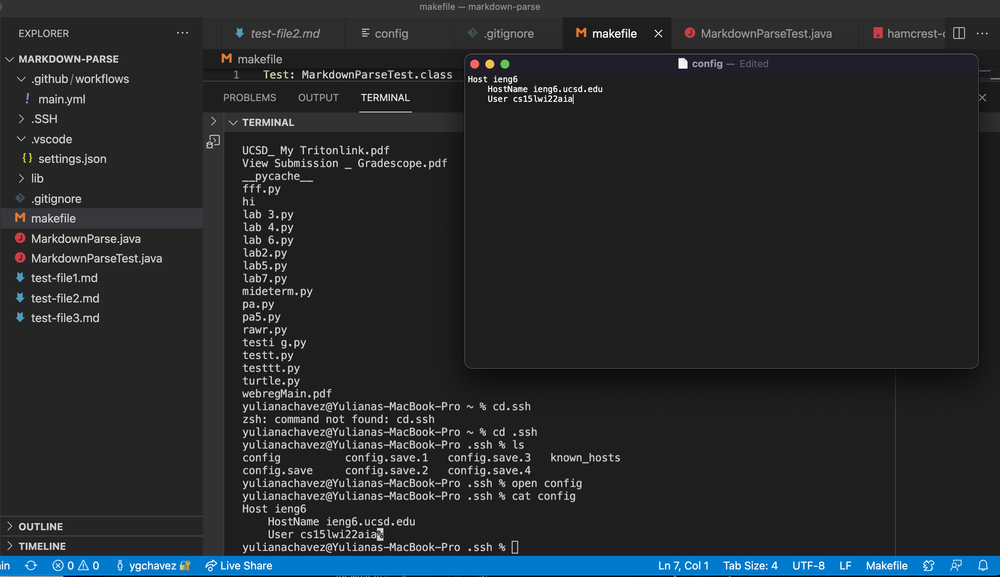

# Lab Report 3
## Streamlining ssh Configuration

## 1. Editing `.ssh/config` file
Using the commands:

`cd ~/.ssh`

`nano config`

I am able to edit the config file in the terminal as shown below and added these lines

## 2. Logging into account with `ssh` command

## 3. Copying a file with `scp` command