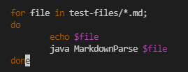
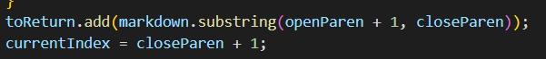

# Lab Report 5
## Finding tests with different results
To find the tests with different results my group made the directories, my_week10 and week10. In my_week10, I used `git clone` to copy my markdown-parse repo in it. I then put in put Professor Politz's markdown-parse repo. Then I copied `test-files` folder with all of the test files into my_week10 using `cp -r week10.txt ~/my_week10/markdown-parse/test-files` in my_week10.

Below I added to my directories to print out the file and their output



Then I ran `diff ~/week10/markdown-parse/week10.txt ~/my_week10/markdown-parse/my_results.txt > differences.txt` to get a text file with the differences between the two output files. I also used `vimdiff ~/week10/markdown-parse/week10.txt ~/my_week10/markdown-parse/my_results.txt` to get a view of the differences. 

## Test 1 [41.md](https://github.com/ucsd-cse15l-w22/markdown-parse/blob/main/test-files/41.md)

Result: `[url &quot;tit&quot;]`

Expected Output: `[]`

Mr. Politz's implementation correctly got the desired output for 41.md. This is because the "a" doesn't show up as a link, so there is no link to put in, so his is correct when it returns `[]`.

### Incorrect Implementation
I can fix my code by adding code to see whether there's a `"&quot;"` in between the quotes. When the "link" has a space in it and a `"&quot;"`, it isn't supposed to be counted as a link but keeps going on and gets all of the link to the end. In this code:
```
            int openParen = line.indexOf("(", currentIndex);
            int closeParen = line.indexOf(")", openParen);
            toReturn.add(line.substring(openParen + 1, closeParen));
            currentIndex = closeParen + 1;
```
I can add a line checking for a space and `&quot;` between the index at openParen and that of closeParen and if it exists, then I should just return the quote from openParen.

## Test 2 [22.md](https://github.com/ucsd-cse15l-w22/markdown-parse/blob/main/test-files/22.md)

Result: `[/bar\* "ti\*tle"]`

Expected Output: `[ "/bar*" ]`

For this test there is no valid link as there are characters between the brackets and parentheses and the second one is missing a parentheses. The method should return an empty array. 

### Incorrect Implementation
My implementation could be fixed by adding a split statement on the substring, checking if the second param is a valid string and passing the first element i.e. if the substring follows ```<link> ["optional hover text"]``` where the quotes are necessary.


